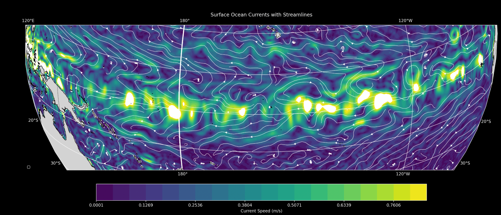

# Ocean Current Vector Topology

## Overview

A geospatial analysis and visualization tool for surface ocean current data. The system processes NetCDF ocean current datasets to identify and classify critical points in vector fields, such as saddle points, sinks, sources, and spiral patterns. It features two main visualization approaches: vector field plots with quiver arrows showing current direction and magnitude, and streamline plots that trace the flow patterns of ocean currents. We use advanced computational geometry techniques to detect critical points by analyzing the Jacobian matrix eigenvalues of the velocity field, enabling researchers to study ocean circulation patterns and identify areas of convergence, divergence, and rotation in global ocean currents.



## Installation Instructions

1. Clone the repository:
   ```bash
   git clone https://github.com/Sodas0/Ocean-Current-VectorTopology.git
   cd Ocean-Current-VectorTopology
   ```

2. Install requirements:
   ```bash
   pip install xarray numpy matplotlib pandas cartopy
   ```

## Usage Instructions

1. Navigate to /src:
   ```bash 
   cd src
   ```

2. Run whichever file you want. e.g.:
   ```bash
   python3 vectorField.py
   ``` 
   or
   ```bash
   python3 streamplots.py
   ```
   
   **Note:** There's a lot of data processing involved, and the runtime is on the slower side. (will optimize later)

   The `vectorField.py` script generates two visualizations:
   - Global vector field plot with current speed contours and directional arrows
   - Critical points classification map showing different types of flow patterns
   
   The `streamplots.py` script creates streamline visualizations showing the flow trajectories of ocean currents.